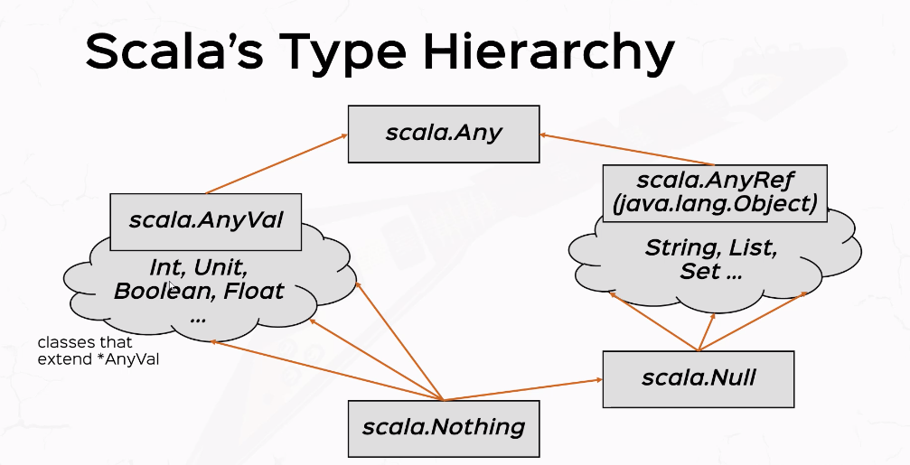
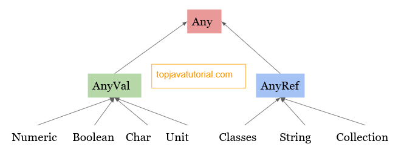

= Scala's type hierarchy

The image above shows the type hierarchy of Scala.

The Any class is the root of the Scala class hierarchy.

Every class in Scala is a subclass of Any. Any has two direct subclasses: AnyVal and AnyRef. AnyVal represents value types.

AnyRef represents reference types. AnyRef is the equivalent of Java's Object class in Scala.

